# Class Diagram

This diagram illustrates the core architecture of AAC Voice API, showing the relationships between main classes
and their responsibilities 

```mermaid
classDiagram
    class index {
       
    }

    class AACVoiceApi {
        - converter: SpeechConverter
        
        + initiate(url: String, language: String) : void
        + start() : void
        + stop() : void
        + displayCommandHistory() : void
    }

    class AudioInputHandler {
        - stream: MediaStream
        - ctx: AudioContext
        - processor: ScriptProcessorNode
        + isListening: Boolean
        
        + onAudioChunk(chunk: Float32Array) void
        + getSampleRate() number
        + startListening() Promise~void~
        + stopListening() void
        
    }
    
    class CommandHistory {
        - history: string[]
        - enabled: Boolean
        - instance: CommandHistory$ 
        
        + getInstance() CommandHistory$
        + toggle(enable: Boolean) void
        + add(command: string) void
        + getAll() string[]
        + getSize() number
        + getSlice(start: number, end: number) string[]
        + clear() void
    }
    
    class CommandLogEntry {
        <<interface>>
        + timestamp: Date
        + commandName: string
        + status: string
    }
    CommandHistory ..|> CommandLogEntry
    
    class GameCommand {
     <<interface>>
     + name: string
     + description: string
     + active: Boolean
     
     + action() void
    }
    
    class commandLibrary {
        - commandMap: Map<string, GameCommand>
        - instance: CommandLibrary$
        
        + getInstance() CommandLibrary$
        - normalize(name: string) string
        + add(command: GameCommand) Boolean
        + remove(name: string) Boolean
        + has(name: string) Boolean
        + get(name: string) Boolean
        + list() GameCommand[]
        + clear() void
    }
    commandLibrary ..|> GameCommand
    
    class CommandMapping {
        - library: CommandLibrary
        
        - normalize(name: string) string
        + addCommand(name: string, action() void, options(description: string, active: Boolean)) Boolean
        + removeCommand(name: string) Boolean
        + getAllCommands() string[]
        + hasCommand(name: string) Boolean
        + getCommand(name: string) GameCommand | undefined
        + clearAllCommands() void
    }
    
    class showHistoryPopup {
        - commandHistory: CommandHistory
        
        + showHistoryPopup() void
    }
    
    class SpeechConverter {
        - whisper: WhisperModule | null
        - audioHandler: AudioInputHandler | null
        - transcribedText: CommandHistory | null
        - transcriptionInterval: ReturnType<setInterval>
        
        - loadModelToFS(modelPath: string) Promise~string~
        + init(modelPath: string, lang: string) Promise~void~
        - downSample(input: Float32Array, inputRate: number, outputRate: number) Float32Array
        - combineChunks(buffer: Float32Array[], blockSize: number) Float32Array
        + startListening() void
        + stopListening() void
        - setAudio(index: number, audio: Float32Array) number
        + getTranscribed() string
        + getStatus() string
        + createWhisperModule() Promise~WhisperModule~
    }
    
    class WhisperModule {
        <<interface>>
    }
    SpeechConverter ..|> WhisperModule
    class SpeechToText {
        
    }
    
    class CommandConverter {
        - library: CommandLibrary
        - commandHistory: CommandHistory
        - instance: CommandConverter$
        
        - onCommandMatched(commands: GameCommand[], transcription: string) void
        + getInstance() CommandConverter$
        - normalize(word: string) string
        - tokenize(transcription: string) string[]
        + processTranscription(transcription: string) GameCommand[]
        - logCommand(command: GameCommand, originalText: string, status: string) void
        
    }
    SpeechToText: This class is currently empty.
    
    class CommandMapper {
       
    }
    CommandMapper: This class is currently empty.


    class SpeechSeparation {
       
    }
    SpeechSeparation: This class is currently empty.

    SpeechConverter ..> AudioInputHandler
    SpeechConverter ..> CommandHistory
    showHistoryPopup ..> CommandHistory
    AACVoiceApi ..> showHistoryPopup
    AACVoiceApi ..> SpeechConverter
    CommandMapping ..> commandLibrary
    CommandConverter ..> commandLibrary
    CommandConverter ..> CommandHistory
    AACVoiceApi *-- SpeechToText : contains
    AACVoiceApi *-- CommandMapper : contains
    index ..> AACVoiceApi
    index ..> commandLibrary
    AudioInputHandler *-- SpeechSeparation : contains
```

**Figure 2** Class Architecture of our Api

### index
This is the main entry point for npm package `'aac-voice-api'`.
It exports the core classes, functions, and types that
make up the public API of the library.

### AACVoiceApi
The main entry point for the API. This will be a facade and the only class that a developer will have to initialize.
Initializes voice command recognition and manages the lifecycle of voice listening sessions.

### SpeechConverter
Handles real-time speech-to-text conversion using the Whisper model.
It manages audio input, preprocessing, and transcription directly in the browser.

### CommandHistory
Keeps track of a chronological log of commands.

### commandLibrary
Contains a HashMap that:
- Can be called by CommandMapper.
- Maps a String command to the corresponding GameCommand.

### AudioInputHandler
Handles raw audio stream processing from the user's microphone. Manages Web Audio API components and converts audio into processable chunks.

### showHistoryPopup
Opens a modal that shows the latest commands and auto-refreshes every second.
Storage is unbounded; UI renders only a window (latest PAGE items) for speed.

### SpeechToText
Consumes (from AudioHandlerInput) and converts audio chunks into text transcriptions for command recognition.

### CommandMapper
Maps recognized speech text to configured voice commands and triggers the appropriate functions

### SpeechSeparation (Still in Discussion)
Processes audio to separate speech from background noise, improving recognition accuracy

### Key Relationships 
- AACVoiceApi serves as the orchestrator, containing and coordinating all major components
- AudioHandlerInput captures and preprocessors audio before passing it to the speech recognition pipeline