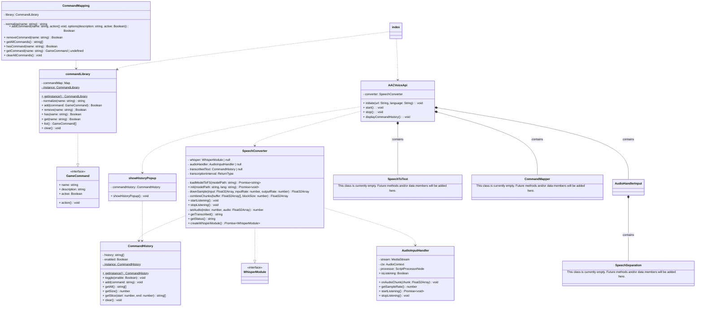

# Class Diagram

This diagram illustrates the core architecture of AAC Voice API, showing the relationships between main classes
and their responsibilites 

**Figure 2** Class Architecture of our Api

### AACVoiceApi
The main entry point for the API. This will be a facade and the only class that a developer will have to initialize.
Initializes voice command recognition and manages the lifeycle of voice listening sessions.

### AudioHandlerInput
Handles raw audio stream processing from the users microphone. Manages Web Audio API components and converts audio into processable chunks.

### SpeechToText
Consumes (from AudioHandlerInput) and converts audio chunks into text transcriptions for command recognition.

### CommandMapper
Maps recognized speech text to configured voice commands and triggers the appropriate functions

### SpeechSeperation (Still in Discussion)
Processes audio to separate speech from background noise, improving recognition accuracy

### Key Relationships 
- AACVoiceApi serves as the orchestrator, containing and coordinating all major components
- AudioHandlerInput captures and preprocessors audio before passing it to the speech recognition pipeline