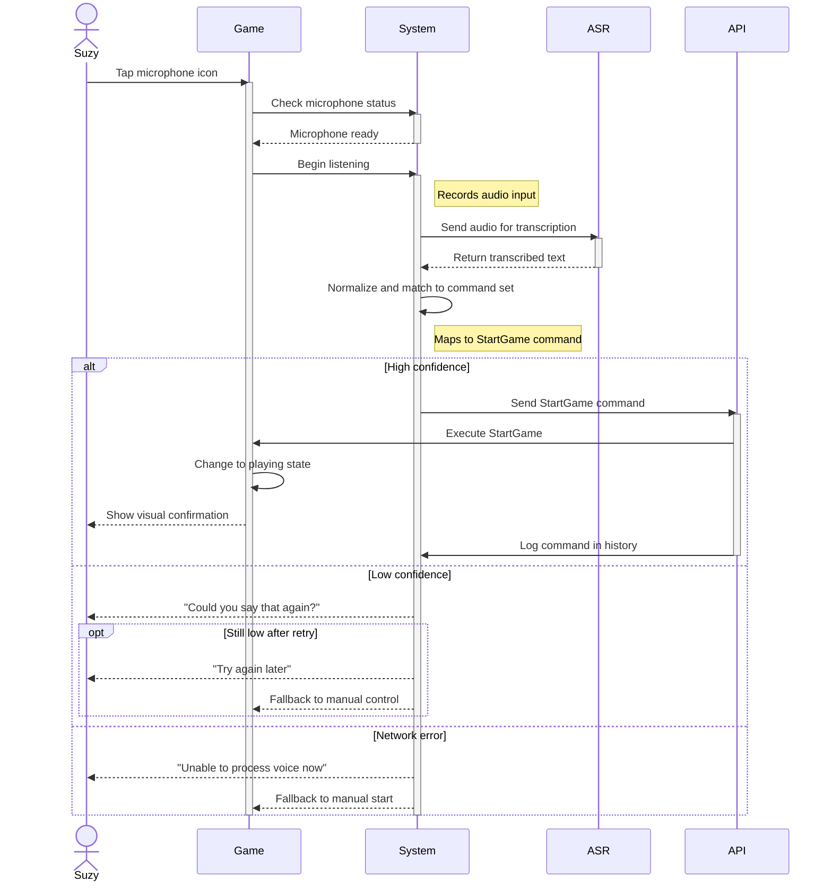
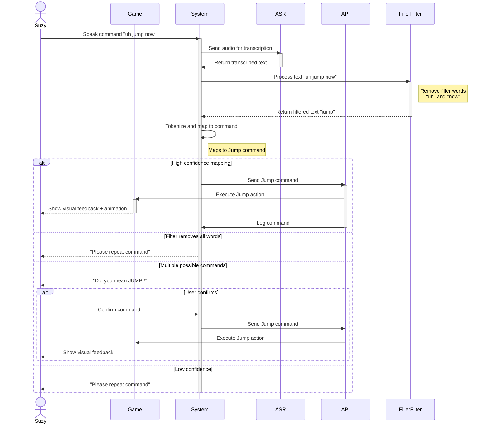
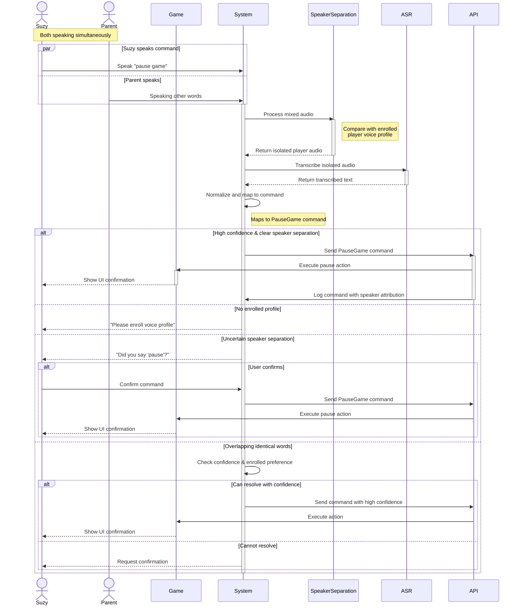
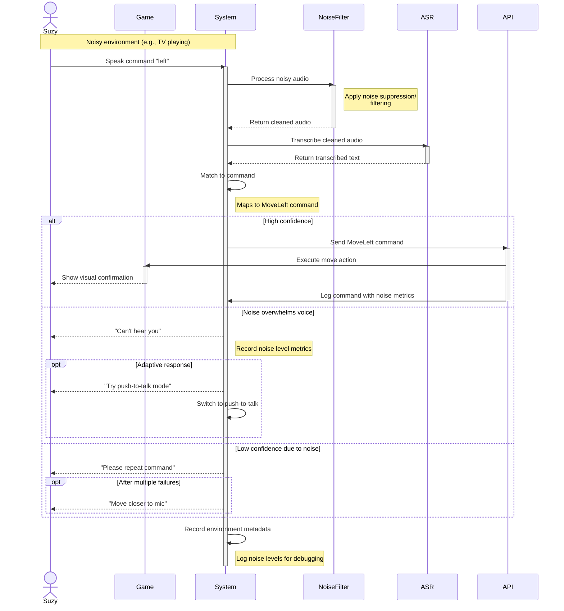
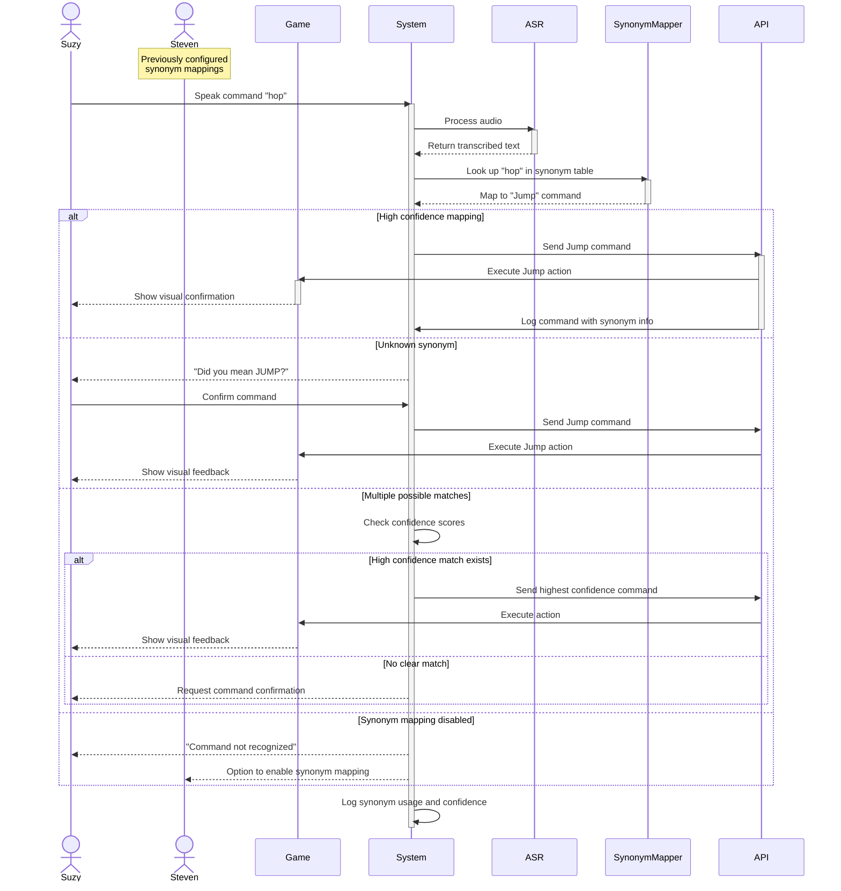
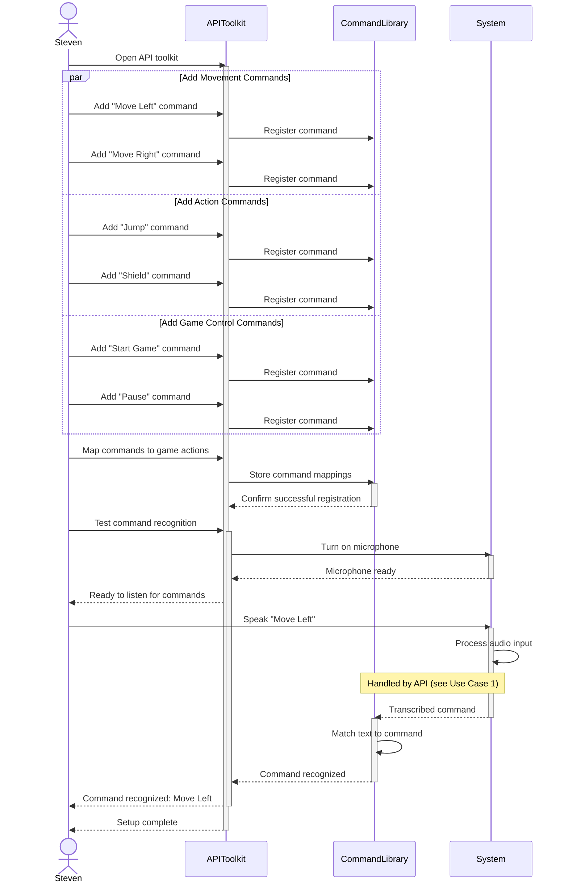
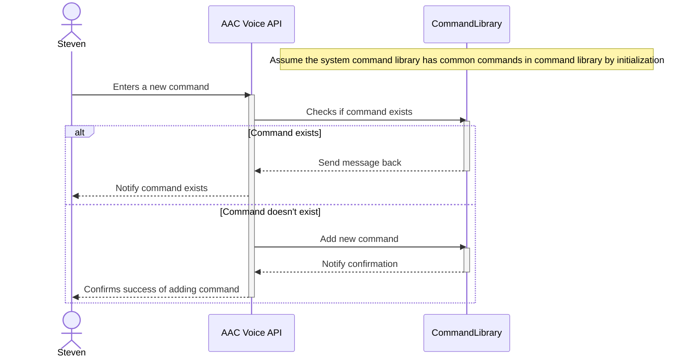
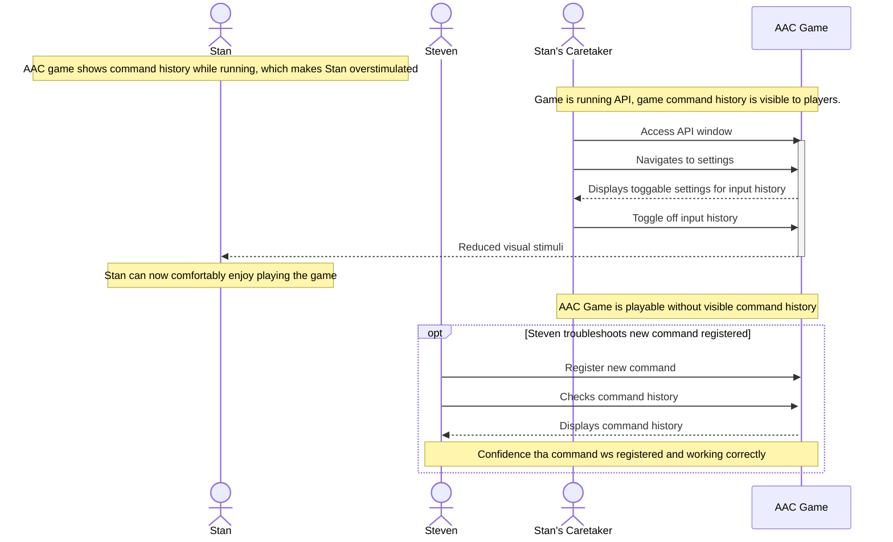
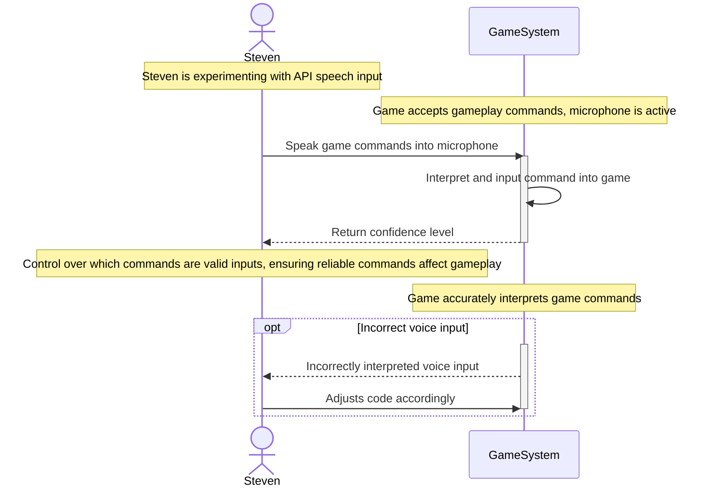

# Sequence Diagrams

### Use Case 1 - Voice Recognition

Actor: Suzy (player / AAC device user)

Triggering event: Suzy opens a supported game and taps the in-game microphone icon (or activates mic).

Preconditions: Game is running and in a state that accepts the Start command; microphone access is granted; network (if required) is available.

Normal flow (happy path):
1. Suzy taps the microphone icon.
2. System checks microphone level and readiness.
3. System begins listening and records the utterance.
4. ASR (speech→text) transcribes the audio.
5. The transcribed text is normalized and matched to the command set; the text maps to the StartGame command.
6. If the command confidence is high, the API sends the StartGame command to the game.
7. The game changes to the playing state and the UI shows confirmation (visual cue like “Game started”).
8. The event is logged in command history.

Alternate flows / exceptions:
1. Low mic level: show prompt “Please increase mic volume / move closer to the device”
2. Low confidence: show prompt “Could you say that again?” → re-listen one retry; if still low, show “Try again later” or offer manual control.
3. Network error: show “Unable to process voice now” and fallback to manual start.

Postconditions: Game has started (or appropriate error/feedback displayed); command logged.

### Use Case 2 - Filter Out Filler Words

Actor: Suzy (player)

Triggering event: Suzy speaks while playing, e.g., “uh jump now.”

Preconditions: Game is in a state that accepts gameplay commands; microphone is active.

Normal flow:
1. The system captures Suzy’s voice.
2. ASR transcribes the audio into text (e.g., “uh jump now”).
3. The pipeline runs a filler-word filter and removes tokens like “uh”, “um”, “now”.
4. Remaining tokens are tokenized and mapped to command(s) (e.g., “jump” → Jump).
5. If mapping confidence is high, the API issues the Jump action to the game immediately.
6. UI gives immediate feedback (visual cue + animation) and logs the command.

Alternate flows / exceptions:
1. Filter removes all meaningful words (e.g., utterance was “uh now”): ask the player to repeat.
2. Multiple possible commands: request quick confirmation (“Did you mean JUMP?”) or choose highest-confidence and log uncertainty.
3. Low confidence: prompt for repeat.

Postconditions: Jump action executed (or user prompted to repeat); command history updated.

### Use Case 3 - Speaker Seperation

Actor: Suzy (primary player) and nearby non-player speakers (e.g., parent)

Triggering event: Suzy speaks a command while other people speak at the same time.

Preconditions: Enrolled player voice profile exists; speaker-separation model is enabled.

Normal flow:
1. System captures mixed audio with multiple speakers.
2. The speaker-separation model isolates the enrolled player’s audio stream (prefer enrolled stream).
3. ASR runs on the isolated player stream and transcribes the utterance.
4. Transcription is normalized and mapped to a game command (e.g., PauseGame).
5. If confidence is high, API sends PauseGame to the game; UI confirms action.
6. Log command and speaker attribution.

Alternate flows / exceptions:
1. No enrolled profile available
2. Separation uncertain / low confidence: show a quick confirmation prompt (“Did you say ‘pause’?”). If the player confirms, proceed; otherwise ignore.
3. Overlapping identical words from multiple speakers: use confidence + enrolled preference; if unresolved, request confirmation.

Postconditions: Game paused (if confirmed); system records speaker attribution and confidence.

### Use Case 4 - Background Noise Filtering

Actor: Suzy (player)

Triggering event: Suzy issues a command in a noisy environment (e.g., TV).

Preconditions: Noise-robust ASR / denoising pipeline active; microphone picks up signal.

Normal flow:
1. System captures the noisy audio.
2. Noise suppression/denoising module processes the audio to reduce background interference.
3. ASR transcribes the cleaned audio.
4. Transcription is matched to a command (e.g., “left” → MoveLeft).
5. If confidence is high, API sends MoveLeft to the game and UI shows visual confirmation.
6. Command and environment metadata (noise level) are logged.

Alternate flows / exceptions:
1. Noise overwhelms voice: prompt the user to repeat or show a “can’t hear” note.
2. Misrecognized phrase due to residual noise: if confidence low, ask for repeat or confirmation.
3. Adaptive fallback: optionally switch to a push-to-talk or require closer mic.

Postconditions: Movement executed (or prompt shown); noise metrics recorded for debugging.

### Use Case 5 - Interpret Synonyms of Commands

Actor: Suzy (player); Developer (configures mapping)

Triggering event: Suzy uses a synonym (e.g., “go” for Move, “hop” for Jump).

Preconditions: Synonym mapping table exists (configured by developer or default set); ASR and command mapper active.

Normal flow:
1. System captures the utterance and ASR produces text (e.g., “hop”).
2. The command-mapping module looks up the token in the synonym table.
3. “hop” is mapped to canonical command Jump.
4. If confidence is high, API issues Jump to the game.
5. Provide visual confirmation and log synonym used and mapping confidence.

Alternate flows / exceptions:
1. Unknown synonym: present developer UI option to register this phrase as a synonym, or prompt the player: “Did you mean JUMP?”
2. Multiple possible canonical matches: prompt for confirmation or use highest confidence mapping.
3. Developer disabled synonym mapping: treat unknown words as unrecognized and prompt to repeat or register command.

Postconditions: Correct canonical command executed or developer/user receives a prompt to resolve ambiguity.

### Use Case 6 - Support Commmon Game Inputs (Incomplete)

Actor: Steven (developer)

Triggering Event: Steven uses the API toolkit to set up the basic commands the game will understand.

Preconditions: Game API has empty command library.

Normal flow:
1. Steven, a game developer, uses the API toolkit, like Start Game, Move Left, Move Right, Jump, Pause, and Shield.
2. They tell the API what each command means and connect those commands to the game’s actions. When a player speaks, the API listens, figures out the right command, and sends it back to the game in a clear format.

Postconditions: System contains common commands in a command library.

### Use Case 7 - Previous Game Integration

Actor: Steven (developer)

Triggering Event: Suzy wants to play an AAC game she used last semester.

Preconditions: System supports current AAC games.

Normal flow:
1. The developer adds a small connector that uses the API’s standard commands.
2. Suzy’s voice inputs still work in the old game without needing to rewrite the code.

Alternate flows / exceptions:
1. The old game is set up in a way that is not compatible with the API.
2. The old game's code needs to be directly modified.

Postconditions: Suzy is able to play the old AAC games using the API.

### Use Case 8 - Register New Commands

Actor: Steven (developer)

Triggering Event: Steven adds new commands to command library through the API to support new game.

Preconditions: System command library has common commands in command library.

Normal flow:
1. System has the ability to register new commands through the API.
2. Steven enters new commands in command library using the API toolkit.
3. This will allow the API to remain flexible to any future games that require more complex commands that are not currently supported.

Alternate flows / exceptions:
1. The system command log already contains all the needed commands for the game.

Postconditions: All commands for the AAC game are entered in the command library, and can be used by players through the API.

### Use Case 9 - Toggle Input History

Actor: Steven (developer); Stan (player)

Triggering Event: Stan is overstimulated by the AAC game.

Preconditions: AAC game is running API and game command history is visible to players.

Normal flow:
1. Stan's caretaker uses the API window and goes to settings.
2. The system has toggleable settings for input history.
3. The caretaker toggles off the input history.
4. Stan receives reduced visual stimuli and can comfortably enjoy playing the AAC game.

Alternate flows / exceptions:
1. Steven has registered a new command and uses the command history to troubleshoot the new command.
2. He has confidence that it was registered correctly and working once he is able to see it in the command history.

Postconditions: AAC game is playable without a visible command history.

### Use Case 10 - Confidence Level of Interpreted Game Input

Actor: Steven (developer):

Triggering Event: Steven is experimenting with API speech input.

Preconditions: Game is in a state that accepts gameplay commands; microphone is active.

Normal flow:
1. Steven speaks game commands into the microphone.
2. The game command is interpreted and inputed to the game.
3. Steven receives a confidence level from the API that determines how confident the API was in choosing that command based on synonyms to a known command.
4. This allows him to have control over which commands are recognized as valid game inputs. ensuring that only reliable commands can affect the gameplay.

Alternate flows / exceptions:
1. The game incorrectly interprets the voice input.
2. Steven adjusts the code accordingly.

Postconditions: Game accurately interprets gameplay commands.

