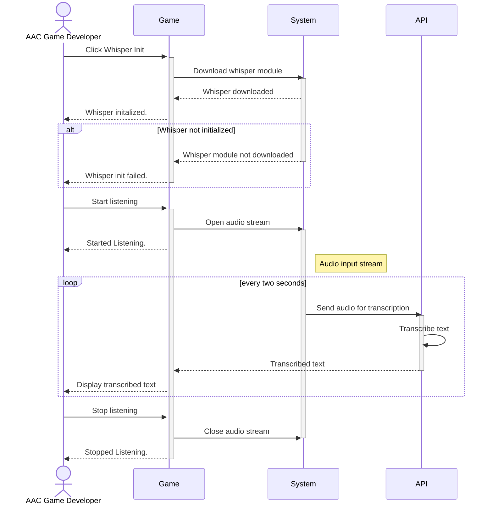
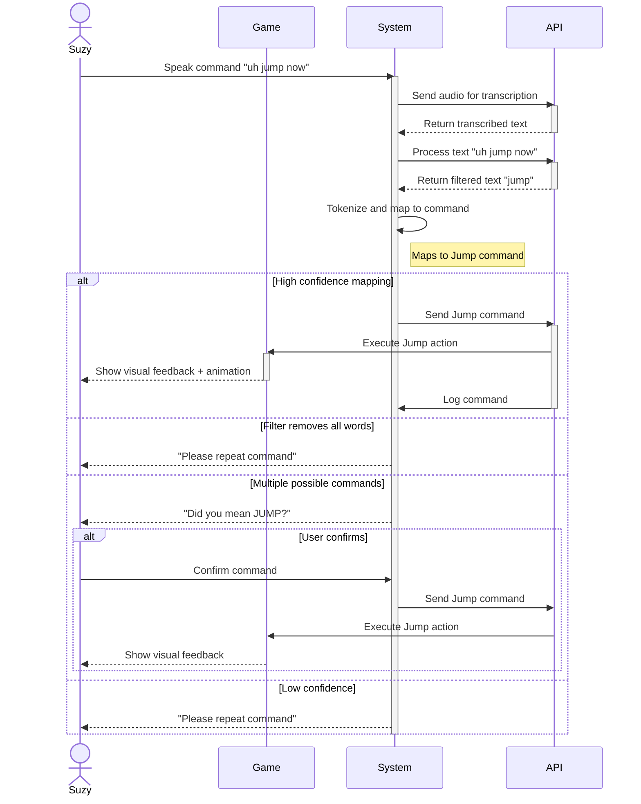
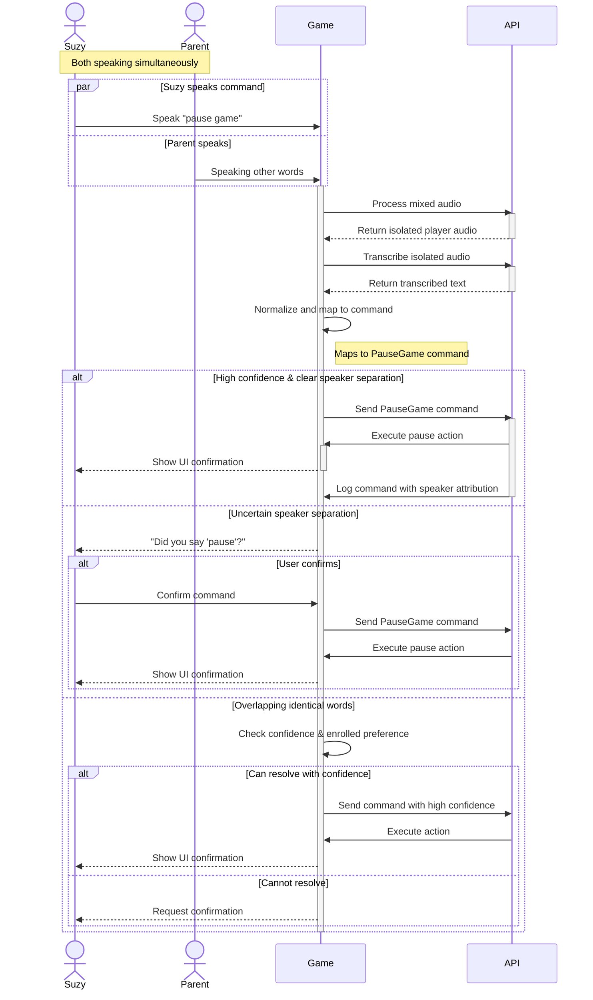
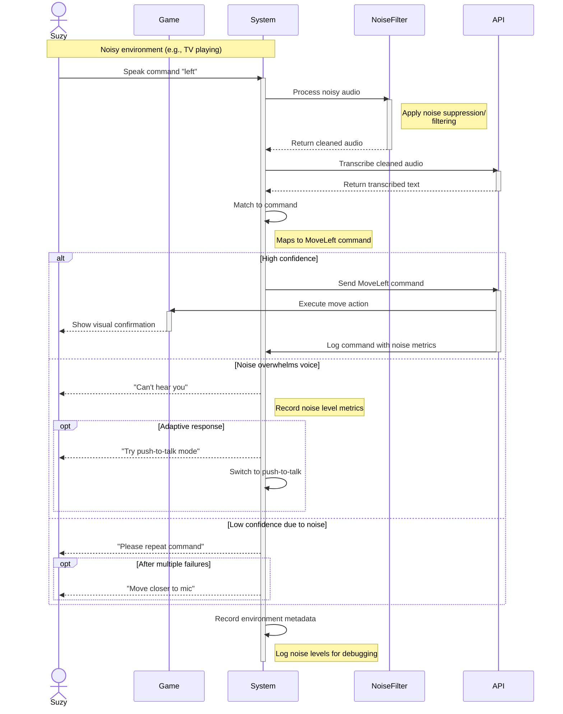
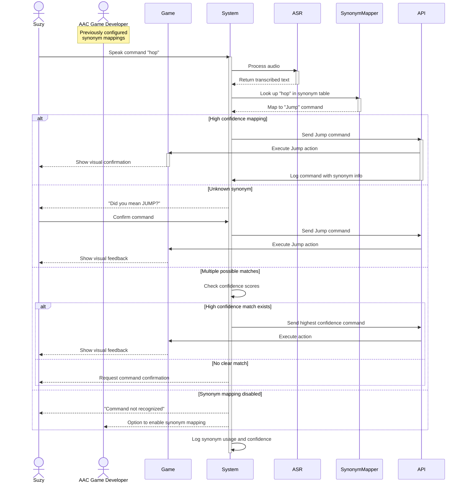
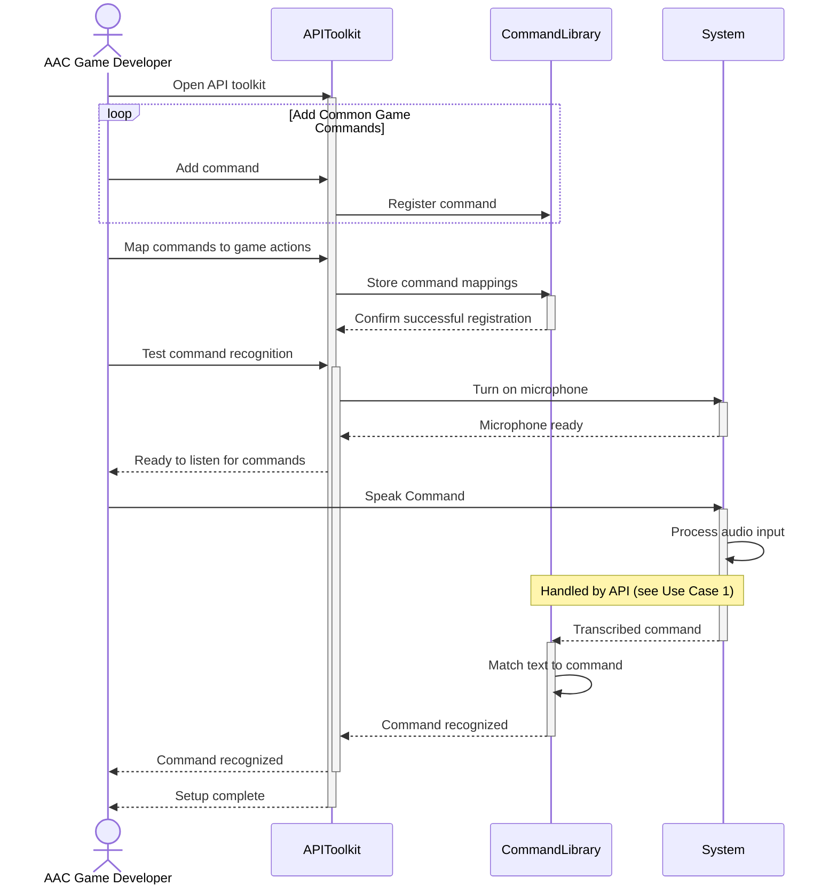
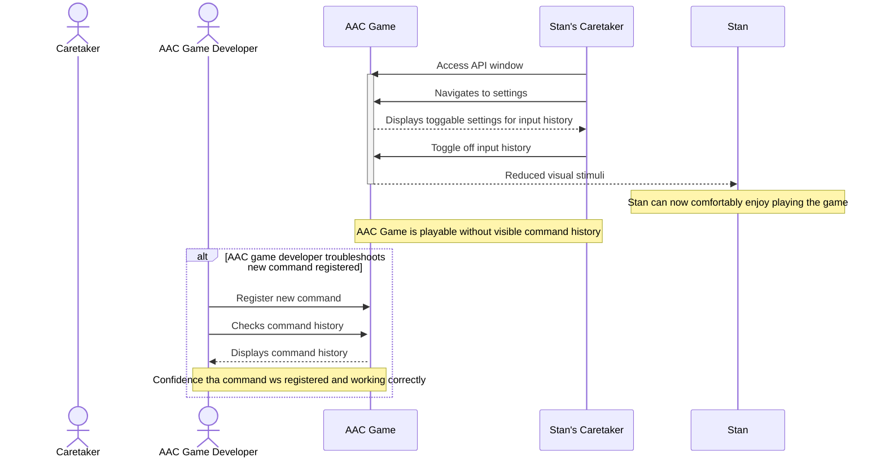
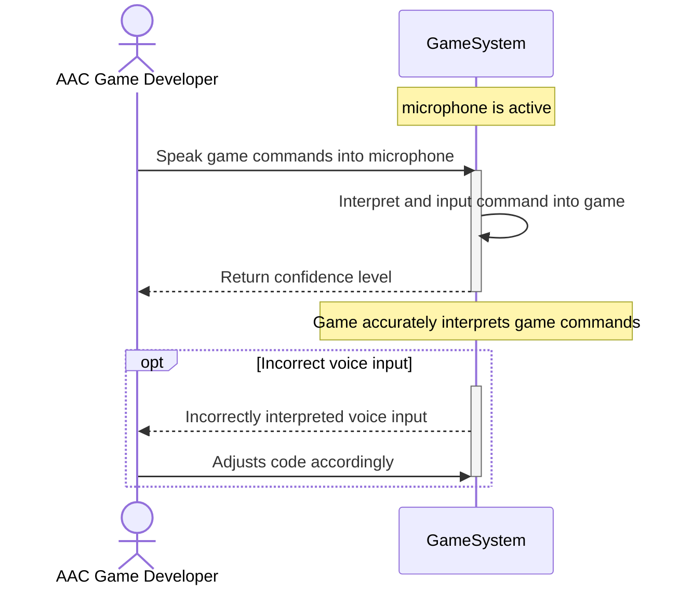

# Sequence Diagrams

### Use Case 1 - Voice Recognition

### Use Case 2 - Filter Out Filler Words

### Use Case 3 - Speaker Seperation

### Use Case 4 - Background Noise Filtering

### Use Case 5 - Interpret Synonyms of Commands

### Use Case 6 - Register Game Commands

### Use Case 7 - Toggle Input History

### Use Case 9 - Confidence Level of Interpreted Game Input

