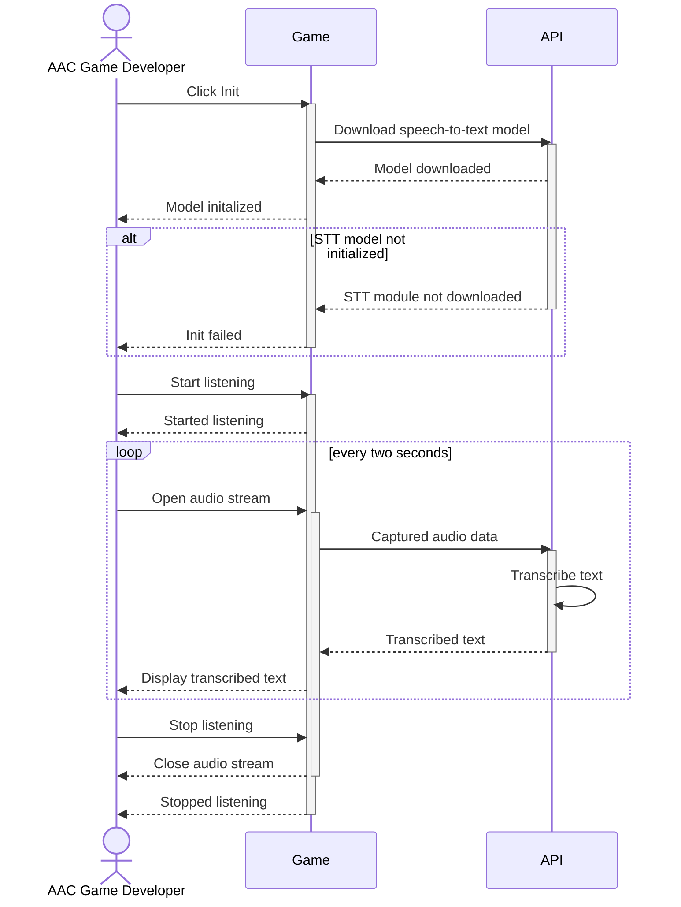
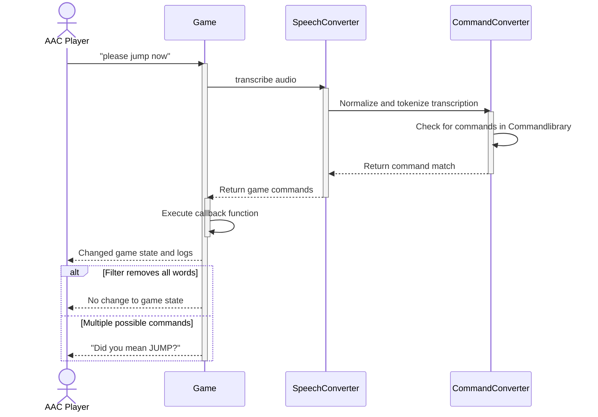
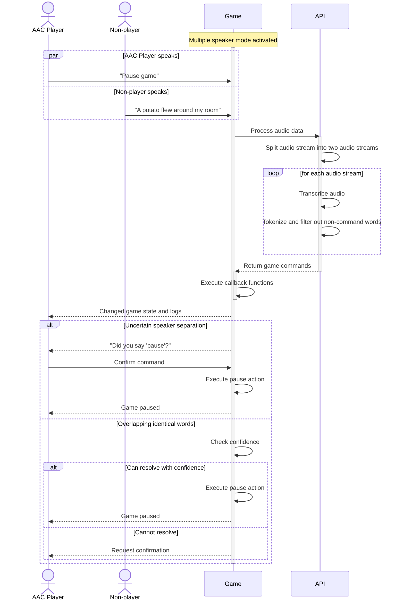
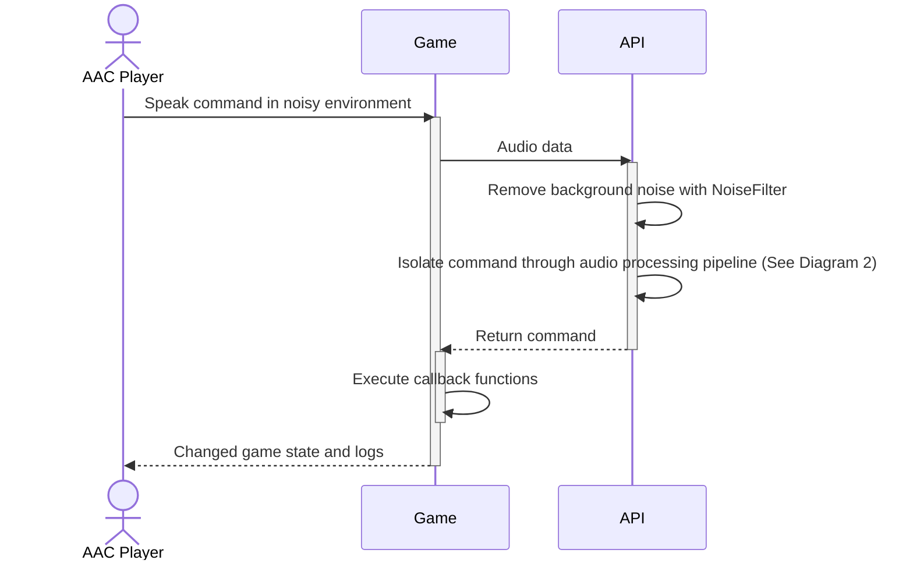
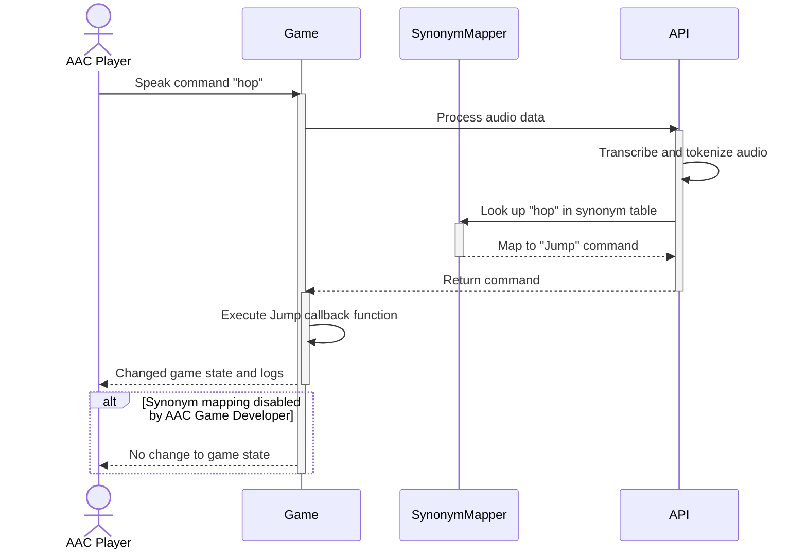
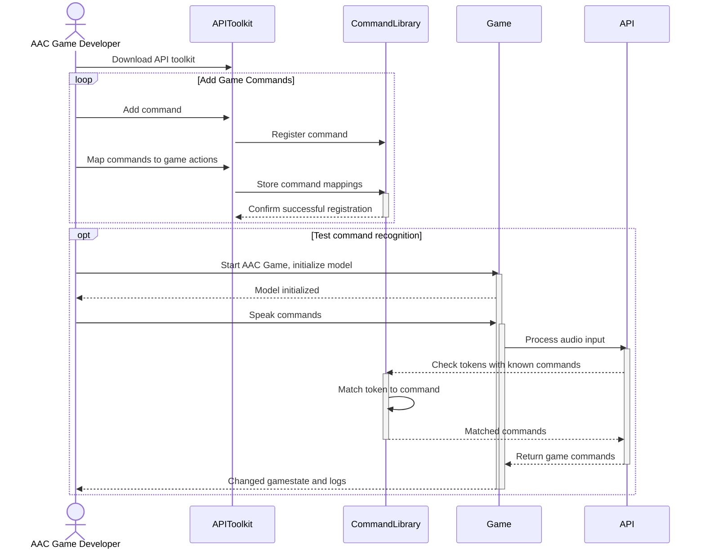
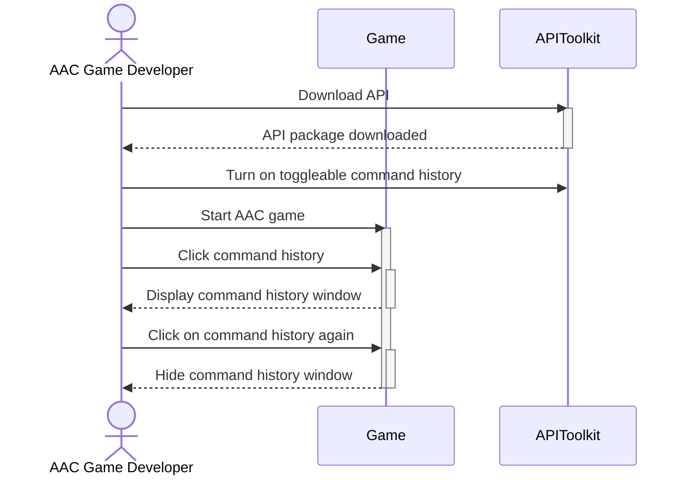
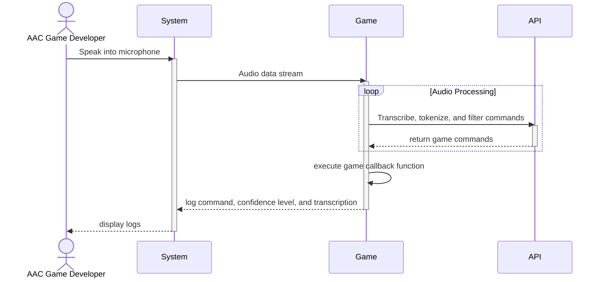

# Sequence Diagrams

### Sequence Diagram 1 - Voice Recognition

Normal flow:
    1. Developer selects online or offline mode.
    2. Developer initializes model.
    3. System downloads model module.
    4. Developer clicks Start Listening.
    5. System begins listening and records the utterance.
    6. API transcribes the audio.
    7. The transcription is sent back to the game and displayed to the developer.
    8. Developer clicks Stop Listening.
    9. System stops listening.

Alternate flows / exceptions:
    1. Model package not downloaded: show prompt “Init failed.” 

### Sequence Diagram 2 - Extract Commands

Normal flow:
    1. The system captures AAC board voice input.
    2. SpeechConverter transcribes the audio into text (e.g., “please jump now”).
    3. The transcription is tokenized by Command Converter.
    4. Tokenized transcription is filtered to remove filler words, sounds, and non-command words (e.g., "please" and "now").
    4. Remaining tokens are mapped to commands.
    5. Commands are sent to the game.
    6. Game displays and logs the commands.

Alternate flows / exceptions:
    1. No command, filter removes all meaningful words (e.g., utterance was “uh now”): no game action.
    2. Multiple possible commands: request quick confirmation (“Did you mean JUMP?”) or choose highest-confidence and log uncertainty.

### Sequence Diagram 3 - Speaker Seperation

Normal flow:
    1. System captures mixed audio with multiple speakers.
    2. The speaker-separation model splits the audio stream into streams for each speaker.
    3. Model runs on the isolated player streams and transcribes the utterance.
    4. Transcription is normalized and mapped to a game command (e.g., PauseGame).
    5. API sends PauseGame to the game; UI confirms action.
    6. Log command and speaker attribution.

Alternate flows / exceptions:
    1. Separation uncertain / low confidence: show a quick confirmation prompt (“Did you say ‘pause’?”). If the player confirms, proceed; otherwise ignore.

### Sequence Diagram 4 - Background Noise Filtering

Normal flow:
    1. System captures the noisy audio.
    2. Noise suppression/denoising module processes the audio to reduce background interference.
    3. ASR transcribes the cleaned audio.
    4. Transcription is matched to a command (e.g., “left” → MoveLeft).
    5. If confidence is high, API sends MoveLeft to the game and UI shows visual confirmation.
    6. Command and environment metadata (noise level) are logged.

Alternate flows / exceptions:
    1. Noise overwhelms voice: Show "no speech detected" note.
    2. Misrecognized phrase due to residual noise: if confidence low, ask for repeat or confirmation.

### Sequence Diagram 5 - Interpret Synonyms of Commands

Normal flow:
    1. System captures the utterance and model transcribes it (e.g., “hop”).
    2. The command-mapping module looks up the token in the synonym table.
    3. “hop” is mapped to canonical command Jump.
    4. API issues Jump to the game.
    5. Provide visual confirmation, log synonym used, and log mapping confidence.

Alternate flows / exceptions:
    1. Developer disabled synonym mapping, and non-command words are filtered out.

### Sequence Diagram 6 - Register Game Commands

Normal flow:
    1. AAC game developer uses the API toolkit to add commands like Start Game, red, blue, green. 
    2. They tell the API what each command means and map those commands to game actions. 
    3. Developer speaks. The API transcribes and tokenizes the audio.
    4. The game executes and logs the command.

Postconditions: System contains common commands in a command library. All commands for the AAC game are entered in the command library, and can be used by players through the API.

### Sequence Diagram 7 - Toggle Input History

Normal flow: 
    1. AAC player's caretaker uses the API window and goes to settings.
    2. The system has toggleable settings for input history.
    3. The caretaker toggles off the input history.
    4. AAC player receives reduced visual stimuli and can comfortably enjoy playing the AAC game.

Alternate flows / exceptions:
    1. Developer has registered a new command and uses the command history to troubleshoot the new command. 
    2. He has confidence that it was registered correctly and working once he is able to see it in the command history.

### Sequence Diagram 8 - Confidence Level of Interpreted Game Input

Normal flow:
    1. Developer speaks game commands into the microphone.
    2. The game command is interpreted and inputted to the game.
    3. Developer receives a confidence level from the API that determines how confident the API was in choosing that command based on synonyms to a known command. 
    4. This allows him to have control over which commands are recognized as valid game inputs. ensuring that only reliable commands can affect the gameplay.

Alternate flows / exceptions:
    1. The game incorrectly interprets the voice input.
    2. Developer adjusts the code accordingly.

