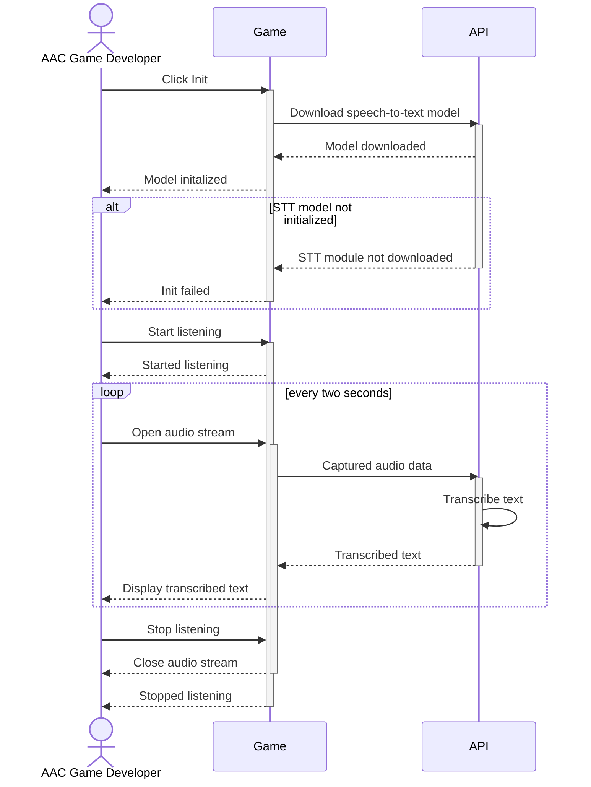
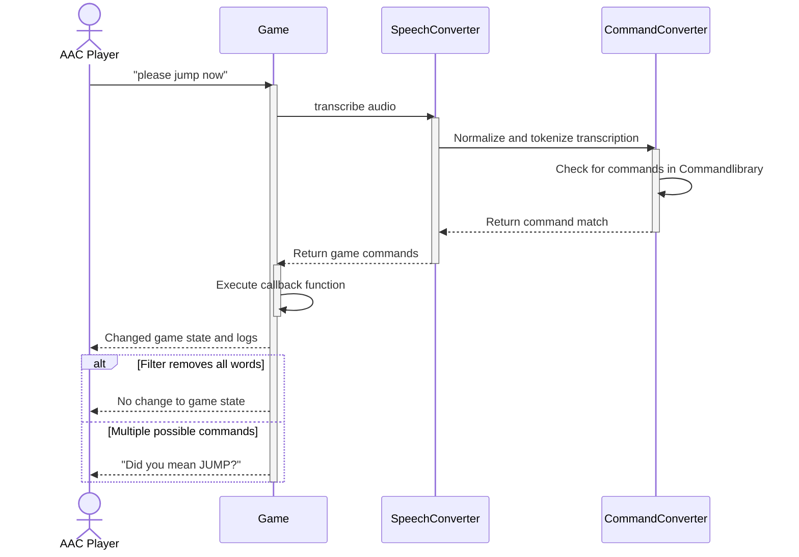
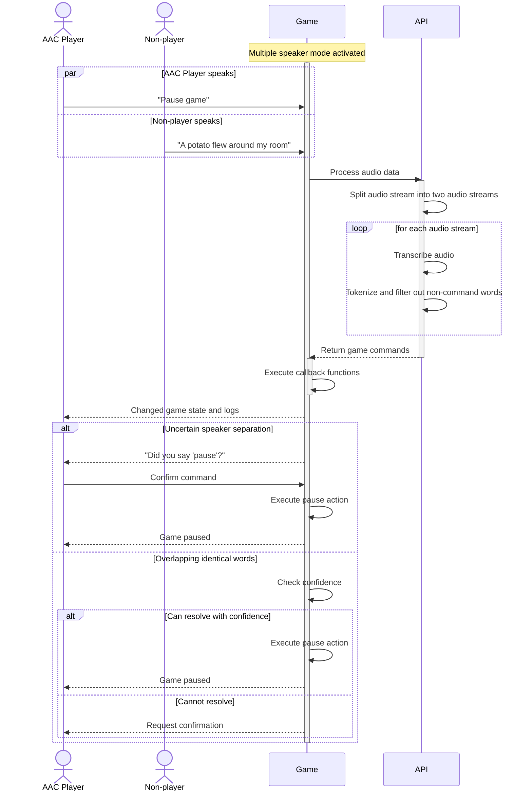
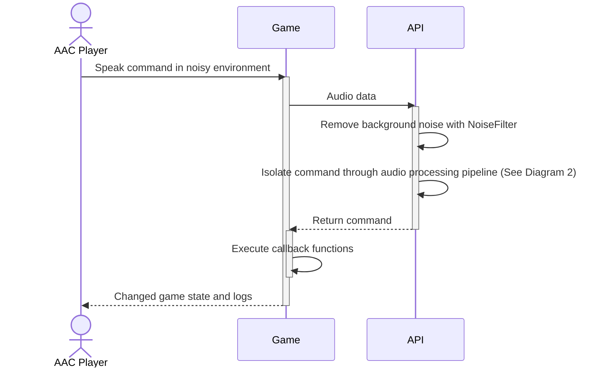
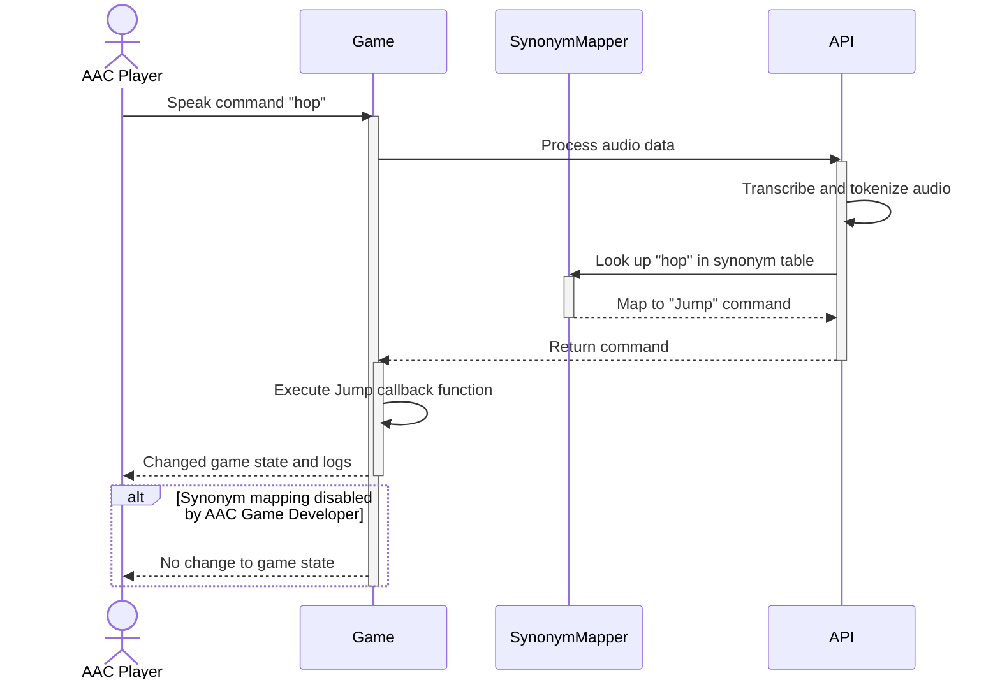
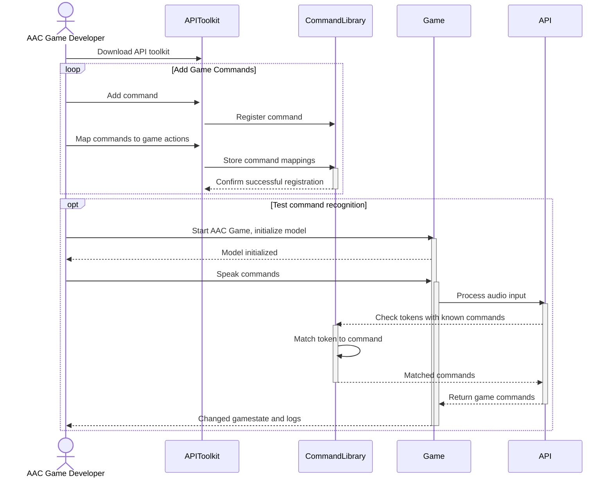
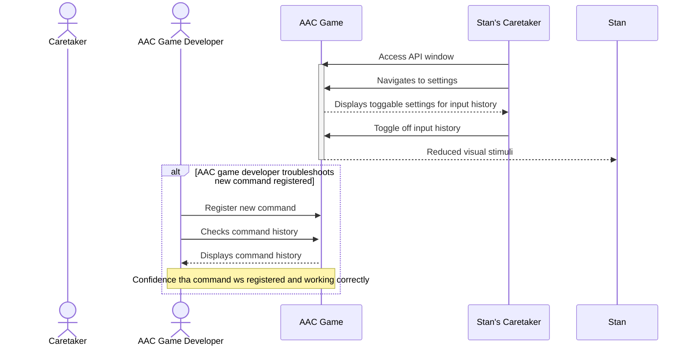
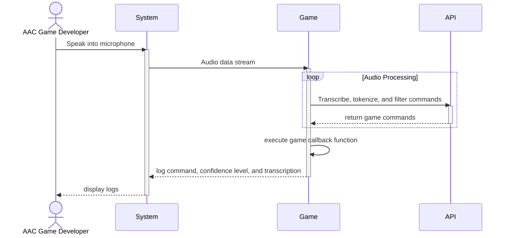

# Sequence Diagrams

### Sequence Diagram 1 - Voice Recognition

### Sequence Diagram 2 - Extract Commands

### Sequence Diagram 3 - Speaker Seperation

### Sequence Diagram 4 - Background Noise Filtering

### Sequence Diagram 5 - Interpret Synonyms of Commands

### Sequence Diagram 6 - Register Game Commands

### Sequence Diagram 7 - Toggle Input History

### Sequence Diagram 8 - Confidence Level of Interpreted Game Input

