# Sequence Diagrams

### Use Case 1 - Voice Recognition

### Use Case 2 - Filter Out Filler Words

### Use Case 3 - Speaker Seperation

### Use Case 4 - Background Noise Filtering

### Use Case 5 - Interpret Synonyms of Commands

### Use Case 6 - Support Commmon Game Inputs

```mermaid
sequenceDiagram
    actor Steven
    participant APIToolkit
    participant CommandLibrary
    participant System
    
    Steven->>APIToolkit: Open API toolkit
    activate APIToolkit
        
    loop Add Common Game Commands
        Steven->>APIToolkit: Add command
        APIToolkit->>CommandLibrary: Register command 
    end
    
    Steven->>APIToolkit: Map commands to game actions
    APIToolkit->>CommandLibrary: Store command mappings
    activate CommandLibrary

    CommandLibrary-->>APIToolkit: Confirm successful registration
    deactivate CommandLibrary
    
    Steven->>APIToolkit: Test command recognition
    activate APIToolkit
    APIToolkit->>System: Turn on microphone
    activate System
    System-->>APIToolkit: Microphone ready
    deactivate System
    APIToolkit-->>Steven: Ready to listen for commands
    Steven->>System: Speak "Move Left"
    activate System
    System->>System: Process audio input
    Note over System, CommandLibrary: Handled by API (see Use Case 1)
    System-->>CommandLibrary: Transcribed command
    deactivate System
    activate CommandLibrary
    CommandLibrary->>CommandLibrary: Match text to command
    CommandLibrary-->>APIToolkit: Command recognized
    deactivate CommandLibrary
    APIToolkit-->>Steven: Command recognized: Move Left
    deactivate APIToolkit
    APIToolkit-->>Steven: Setup complete
    deactivate APIToolkit
```

### Use Case 7 - Register New Commands

### Use Case 8 - Toggle Input History

### Use Case 9 - Confidence Level of Interpreted Game Input

